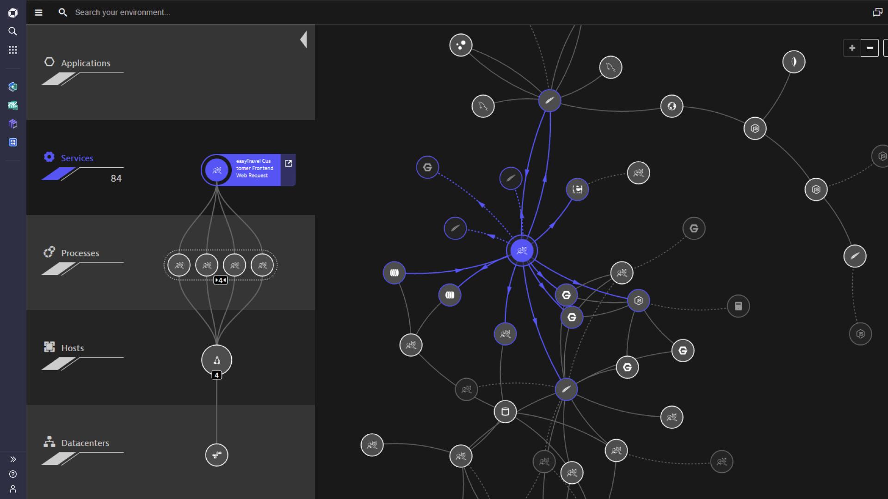

## Tìm hiểu về Dynatrace
### 1. Smart scape topology
#### Khái niệm

Giúp trực quan hóa toàn bộ kiến trúc ứng dụng và hạ tầng theo thời gian thực.

Là công nghệ bản đồ tương tác, tự động hiển thị mối quan hệ giữa các thành phần ứng dụng và hạ tầng.

Được ví như “Google Maps” cho kiến trúc ứng dụng: không cần cấu hình thủ công hay viết script.

#### Tính năng
* Tự động phát hiện: OneAgent tự động khám phá các thành phần và phụ thuộc trong môi trường ứng dụng.
* Quan sát 5 lớp:
  - Ứng dụng
  - Dịch vụ
  - Quy trình (process)
  - Máy chủ (host)
  - Trung tâm dữ liệu (datacenter)
* Hiển thị phụ thuộc:
  * **Chiều ngang**: giữa các thành phần cùng loại (ví dụ: service ↔ service).
  * **Chiều dọc**: giữa các tầng khác nhau (ví dụ: datacenter → host → process → service → application).

### 2. One agent

## Tìm hiểu về Prometheus, Grafana, Alert manager
### Prometheus
Sử dụng các exporter để đọc dữ liệu từ server, phần mềm, đánh giá những metric này và đưa ra cảnh báo tùy theo tiêu chí đã đặt.

Exporter là những phần mềm có vai trò thu thập số liệu từ các ứng dụng, server và đổi thành định dạng mà prometheus có thể đọc được
Có nhiều loại exporter:
•	System exporter: giám sát server, các thiết bị trong mạng qua snmp
•	Application exporter: mỗi ứng dụng có một exporter riêng để giám sát
•	Runtime exporter: giám sát các ứng dụng runtime 
•	Container/ cloud exporter: giám sát các dịch vụ cloud như của Amazon và các container trong docker
•	Custom/ User-defined exporter: tự viết exporter

### Grafana
Trực quan hóa dữ liệu từ Prometheus.

### Alert manager
Cảnh báo cho end user khi phát hiện có bất thường.

## Các tool giám sát, đọc dữ liệu

## Metrics, Logs, Traces

Ba khái niệm Metrics, Logs và Traces là ba loại dữ liệu cốt lõi trong Observability (khả năng quan sát, giám sát hệ thống phần mềm). Mỗi loại cung cấp một góc nhìn khác nhau về trạng thái và hành vi của hệ thống.

### 1. Metrics – Dữ liệu định lượng (số liệu)
📌 Là gì?
Là dữ liệu dạng số, được thu thập liên tục theo thời gian.

Ví dụ: CPU 75%, 1200 request/second, 50ms response time

🔍 Dùng để làm gì?
* Theo dõi hiệu suất, sức khỏe của hệ thống
* Hiển thị trong biểu đồ (Grafana, Prometheus)

🧠 Đặc điểm:
* Nhẹ, dễ lưu trữ
* Có thể dùng để tạo alert (cảnh báo) khi vượt ngưỡng

Ví dụ:
| Thời gian | Metric           | Giá trị |
| --------- | ---------------- | ------- |
| 08:00:00  | CPU Usage        | 68%     |
| 08:00:05  | API Latency      | 45ms    |
| 08:00:10  | Requests per sec | 1200    |

### 2. Logs – Nhật ký sự kiện
📌 Là gì?
Là chuỗi văn bản mô tả một sự kiện trong hệ thống.

Ví dụ: ERROR: Cannot connect to database, User 123 logged in

🔍 Dùng để làm gì?
* Debug lỗi: tìm nguyên nhân sự cố
* Phân tích chi tiết luồng thực thi
* Ghi lại thông tin bảo mật, hành vi người dùng

🧠 Đặc điểm:
* Dữ liệu phi cấu trúc, nhiều thông tin
* Nặng hơn metrics
* Cần log collector để gom lại: Fluentd, Logstash

### 3. Traces – Dấu vết luồng yêu cầu
📌 Là gì?
Là luồng di chuyển của một request qua nhiều service khác nhau.

Giúp bạn hiểu một yêu cầu đi qua đâu, mất thời gian ở đâu.

🔍 Dùng để làm gì?
- Phân tích hiệu năng ứng dụng phân tán (microservice)
- Xác định bottleneck (nút cổ chai)
- Tìm root cause (nguyên nhân gốc) cho request chậm

🧠 Đặc điểm:
- Gồm nhiều span (đoạn), mỗi span là 1 service
- Có thể visualize như biểu đồ Gantt