# 1. Topology là gì?
Topology (cấu trúc liên kết) là khái niệm mô tả cách các thành phần liên kết và giao tiếp với nhau.

## 1.1. Topology trong hệ thống mạng (network topology)
Topology trong hệ thống mạng là cách các thiết bị (máy tính, switch, router,...) kết nối logic/ vật lý với nhau.

Các loại topology trong hệ thống mạng:
* Bus: Mọi thiết bị nối vào một dây chính.
  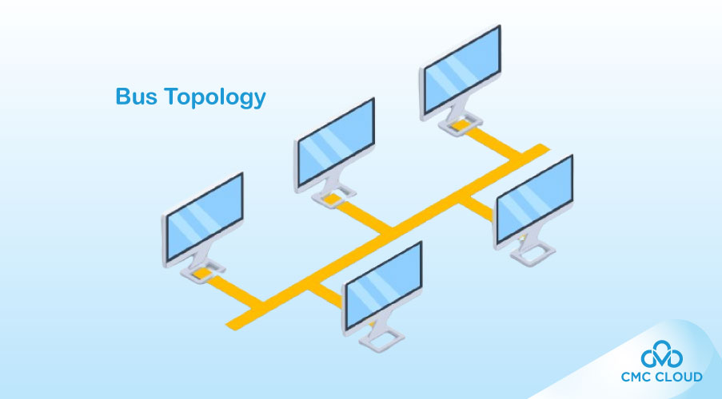
* Star: Mọi thiết bị kết nối vào một thiết bị trung tâm (như switch).
  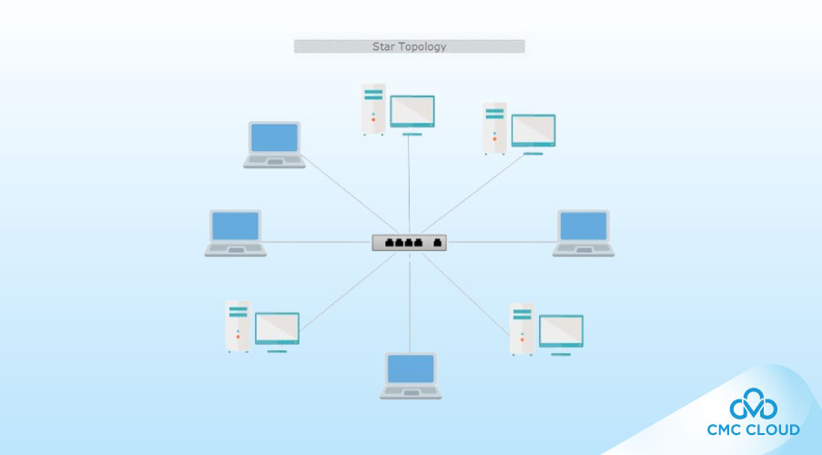
* Ring: Các thiết bị nối với nhau thành vòng kín.
  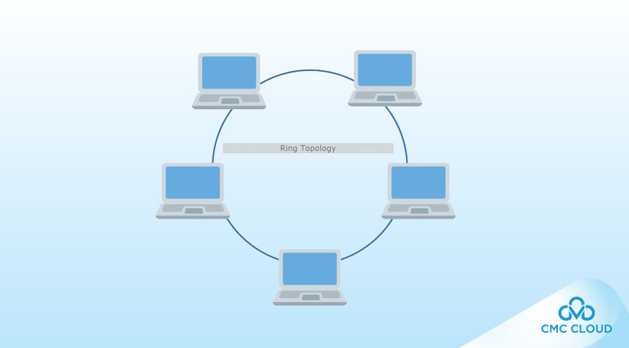
* Mesh: Mỗi thiết bị có thể kết nối với nhiều thiết bị khác.
  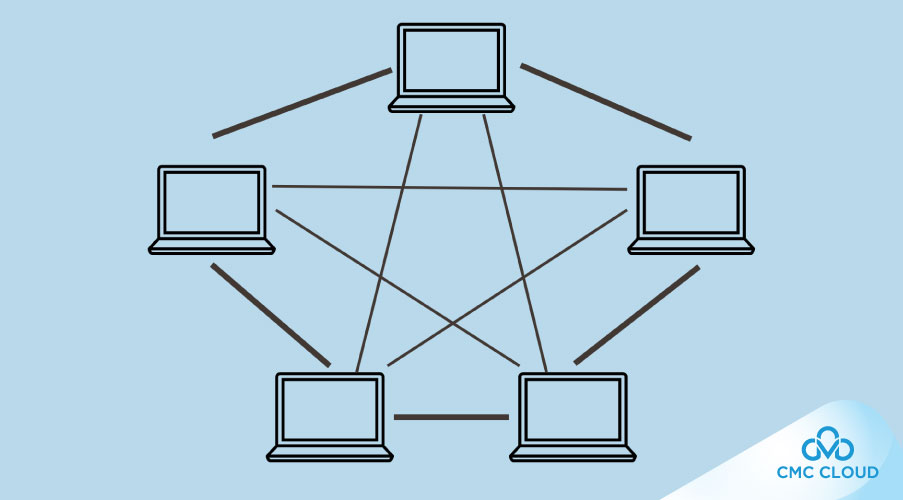
* Tree: 
  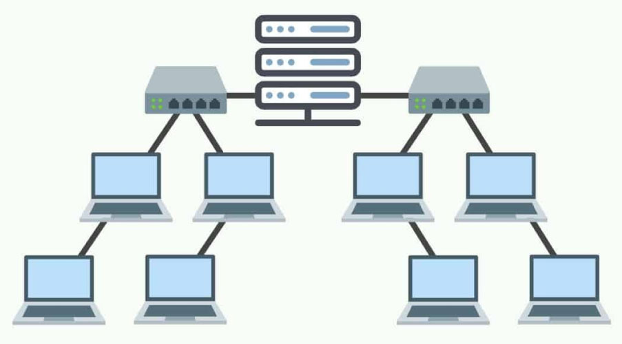
* Hybrid: Kết hợp nhiều loại topology trên.
  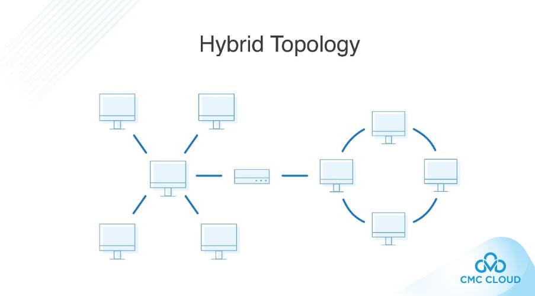

https://cmccloud.vn/tin-tuc/topology-la-gi

## 1.2. Topology trong phần mềm/ hệ thống phân tán
Mô tả cách tổ chức, tương tác, kết nối giữa các thành phần trong hệ thống.
Việc hiểu topology giúp ta:
* Dễ dàng giám sát hệ thống (monitoring)
* Phân tích nguyên nhân khi có lỗi (tracing/ debug)
* Tối ưu hóa hiệu năng hệ thống (load balancing, caching)
* Thiết kế kiến trúc tốt hơn (phân tầng, chia microservice)

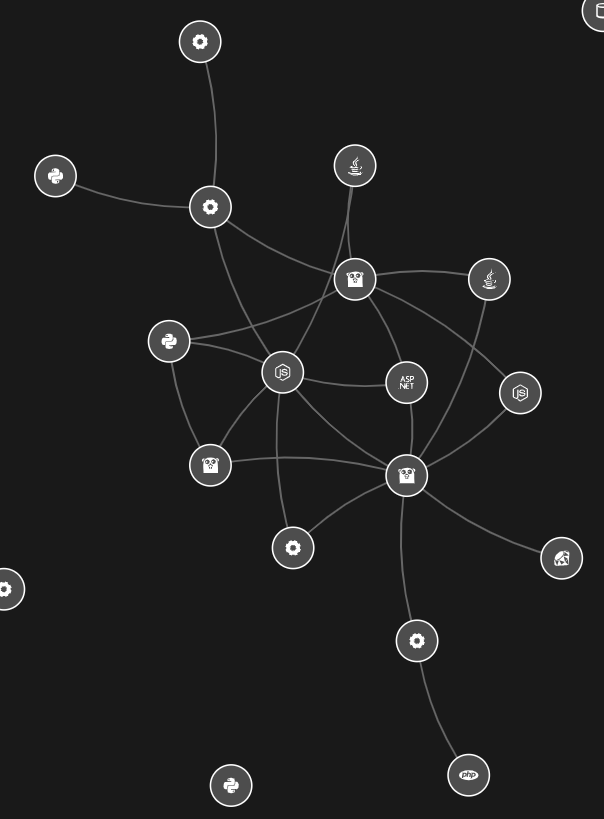

Ví dụ với topo của SmartScape của Dynatrace như trên, khi nhìn vào có thể thấy được mối quan hệ giữa các service. Có thể dựa vào đó để debug lỗi/ hình dung hệ thống tốt hơn.

# 2. Kiến trúc phần mềm (Software architecture)
Kiến trúc phần mềm mô tả cách triển khai, cấu trúc, liên kết dự án phần mềm.

Có nhiều cách phân loại kiến trúc phần mềm:
* Monolithic/ Distributed architecture: Kiến trúc nguyên khối/ phân tán (dựa theo triển khai vật lý)
  

    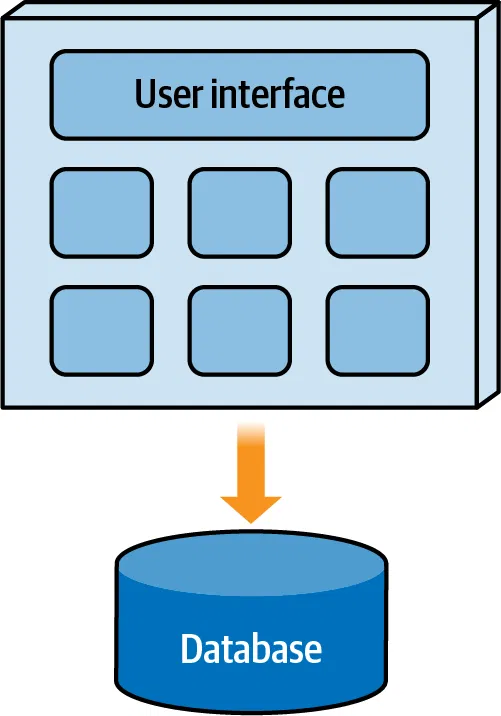
    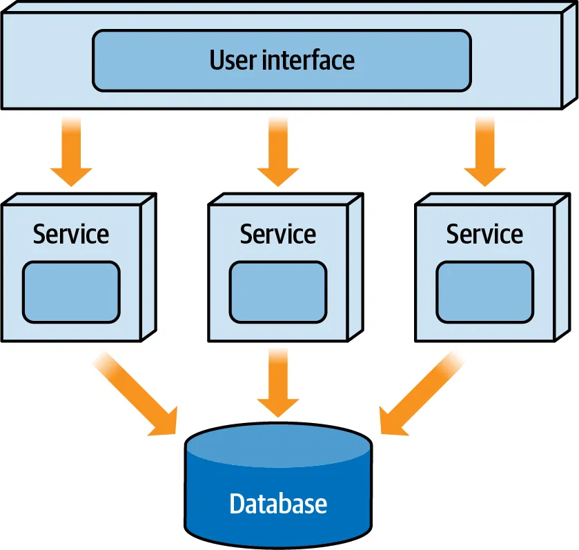
  

* Technically/ Domain partitioned: Phân vùng kỹ thuật/ domain 
  

    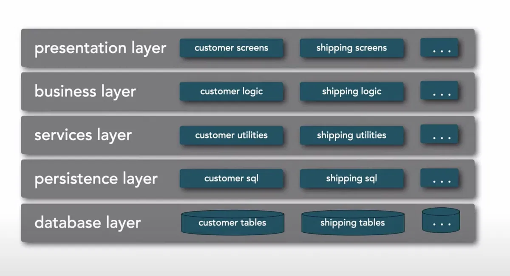
    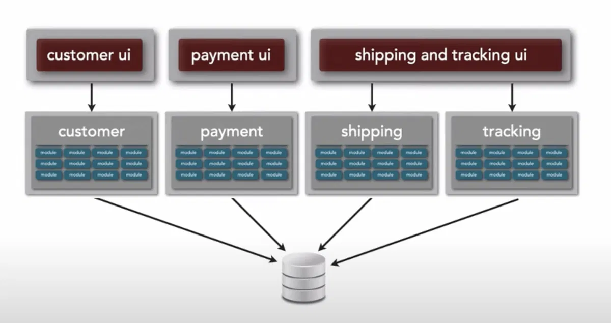
  

https://200lab.io/blog/cach-phan-loai-cac-loai-kien-truc-phan-mem-phan-1

Trong phạm vi dự án NOCPro thì ta sẽ quan tâm đến cách các thành phần liên kết vật lý với nhau như thế nào. Nên sẽ chỉ tìm hiểu về ***Monolithic*** và ***Distributed*** architecture thôi.

## 2.1. Kiến trúc nguyên khối (Monolithic architecture)

> Kiến trúc nguyên khối (Monolithic architecture) được triển khai trên một đơn vị duy nhất (single deployment unit).

> Đơn vị triển khai (Deployment unit) đề cập đến một đơn vị phần mềm độc lập và riêng biệt về mặt logic, có thể được triển khai, lập phiên bản và quản lý độc lập trong một ứng dụng. Ví dụ, trên một server, bạn có thể cài một database và một service. Ở đây, chúng ta có hai đơn vị triển khai.

Các mẫu kiến trúc phần mềm nằm trong nhóm kiến trúc nguyên khối:
- Kiến trúc phân lớp (Layered architecture)
- Kiến trúc client-server
- Kiến trúc đường ống (Pipeline architecture)
- Kiến trúc vi nhân (Microkernel architecture)

### 2.1.1. Kiến trúc phân lớp (Layered architecture/ 3-tiers architecture)
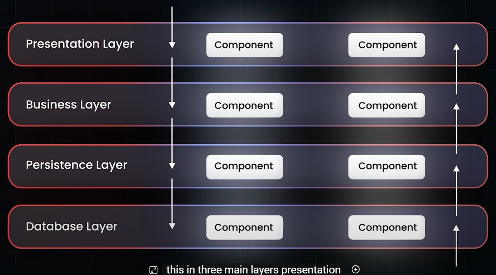

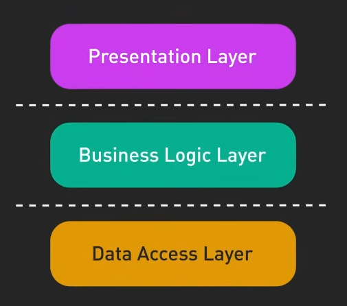

### 2.1.2. Micro-kernel architecture
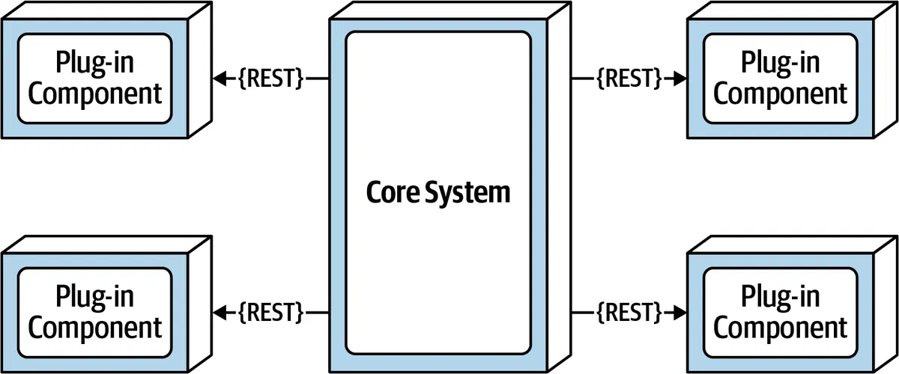

## 2.2. Kiến trúc phân tán (Distributed architecture)
> Kiến trúc phân tán (Distributed architecture) được triển khai trên nhiều đơn vị (multiple deployment units) làm việc cùng nhau để thực hiện một số loại chức năng business gắn kết.

Các mẫu kiến trúc phầm mềm nằm trong nhóm kiến trúc phân tán:
- Kiến trúc hướng sự kiện (Event-driven architecture)
- Kiến trúc microservice (Microservices architecture)
- Kiến trúc hướng không gian (Space-based architecture)
- Kiến trúc hướng dịch vụ (Service-oriented architecture)

### 2.2.1. Event driven architecture
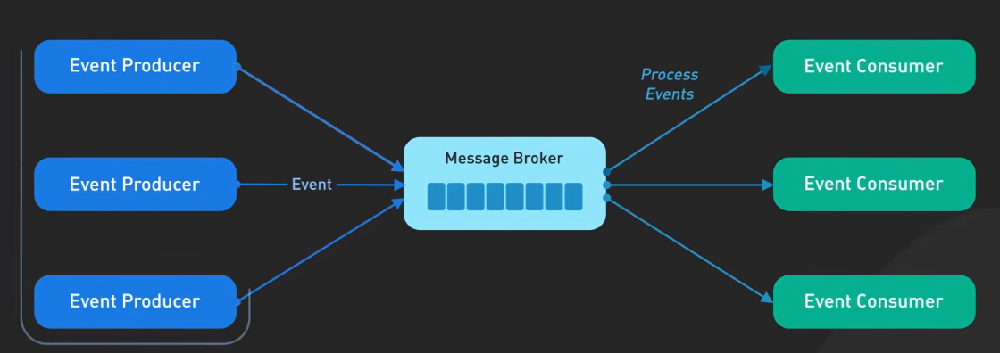

### 2.2.2. Microservices architecture
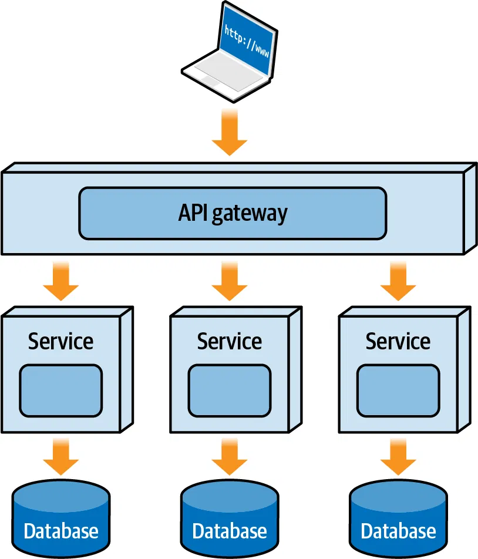

## 2.3. Mối quan hệ giữa kiến trúc nguyên khối và phân tán
Trong hệ thống phân tán, mỗi đơn vị triển khai thường được xây dựng theo kiểu monolithic:
* Nó vẫn có thể dùng layered architecture (controller → service → repository).
* Nó vẫn đóng gói thành một process, một package (ví dụ: .jar, .exe, container image).
* Các thành phần bên trong unit đó giao tiếp in-process (gọi trực tiếp trong bộ nhớ).

Điểm khác biệt là mỗi đơn vị trong hệ thống phân tán thường có quy mô nhỏ hơn, chuyên xử lý cho một domain (lĩnh vực) nhất định.

Nói cách khác thì hệ thống phân tán là hệ thống bao gồm các mini-monolithic tương tác với nhau.

