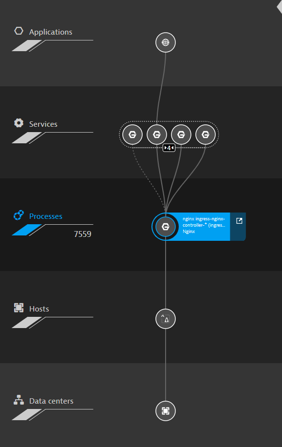
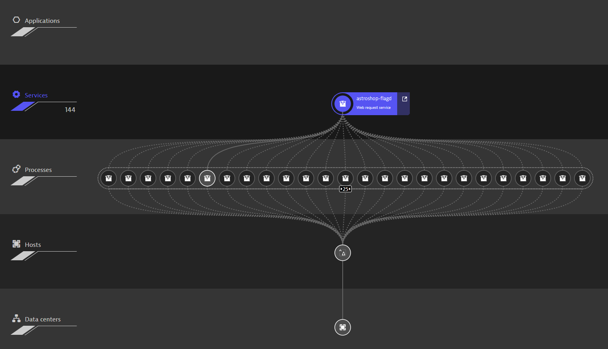
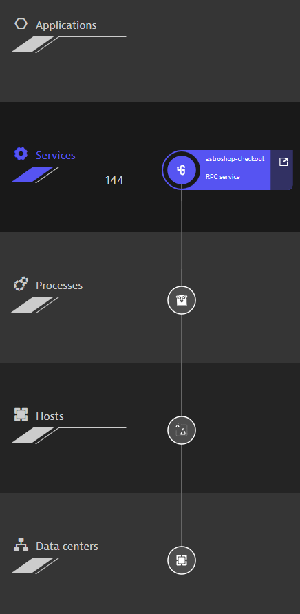

- [Tìm hiểu các tầng trong Smartscape của Dynatrace](#tìm-hiểu-các-tầng-trong-smartscape-của-dynatrace)
  - [Applications (ứng dụng)](#applications-ứng-dụng)
  - [Services (dịch vụ)](#services-dịch-vụ)
    - [Các loại service trong SmartScape](#các-loại-service-trong-smartscape)
    - [Cách Dynatrace detect DB service](#cách-dynatrace-detect-db-service)
    - [TCP sniff](#tcp-sniff)
  - [Processes (tiến trình)](#processes-tiến-trình)
    - [Phân biệt giữa Services và Processes](#phân-biệt-giữa-services-và-processes)
    - [Mối quan hệ giữa Services và Processes](#mối-quan-hệ-giữa-services-và-processes)
  - [Hosts (máy chủ)](#hosts-máy-chủ)
  - [Datacenters (hạ tầng)](#datacenters-hạ-tầng)
- [Phân tích yêu cầu](#phân-tích-yêu-cầu)
  - [Đầu vào (Input)](#đầu-vào-input)
  - [Đầu ra (Output)](#đầu-ra-output)
- [Database](#database)
- [References](#references)

# Tìm hiểu các tầng trong Smartscape của Dynatrace
SmartScape của Dynatrace chia một hệ thống làm 5 tầng:
* Applications: ứng dụng
* Services: dịch vụ
* Processes: tiến trình
* Hosts: máy chủ
* Datacenters: hạ tầng

## Applications (ứng dụng)
Bao gồm web-based và mobile application, là giao diện tương tác với end user.

Các SmartScape detect (phát hiện) được application và track hành vi người dùng:
* **Đối với web-based application**: nhúng dynatrace RUM Javascript Agent vào code
* **Đối với mobile application**: tích hợp Dynatrace mobile OneAgent SDK vào app khi build

Khi nhúng Dynatrace OneAgent vào mobile/ web application, khi người dùng truy cập ứng dụng:
* Thu thập dữ liệu hiệu năng, crash, network request.
* Tự động gửi dữ liệu về Dynatrace server.

Các request mà app gửi đến backend (API, web service) sẽ chứa headers / metadata để Dynatrace correlate với backend trong Smartscape.

**Điểm mấu chốt**: Dynatrace không "bắt" từ ngoài, mà app tự báo cáo về hệ thống thông qua SDK.

Ứng dụng sẽ được Dynatrace detect khi người dùng truy cập vào ứng dụng và OneAgent đã nhúng được kích hoạt. Nếu không nhúng OneAgent vào ứng dụng, Dynatrace vẫn track được thông qua các request đến Backend nhưng mà ẩn danh (không hiện trong tầng Applications).

## Services (dịch vụ)
Hiển thị topo của tất cả các service. Mỗi node được hiển thị bằng một biểu tượng đại diện cho công nghệ của service đấy.

Connection:
* **Nét liền**: Có request trong vòng 2h
* **Nét đứt**: Không có request trong hơn 2h
* **Không có kết nối**: Không có request trong hơn 72h
* **Hướng mũi tên**: từ node gửi request đến node nhận

### Các loại service trong SmartScape
- **Web Request Service**
  Xử lý HTTP/S request từ ứng dụng web, API, hoặc backend.  
  Gom các request dựa trên endpoint URL, framework, hoặc công nghệ web server (Tomcat, Nginx, Node.js, ASP.NET, Spring Boot…).  
  Ví dụ: /checkout, /api/products.

- **Web Service**
  Dịch vụ xử lý SOAP/XML hoặc gRPC.  
  Phát hiện qua endpoint WSDL, SOAP action, hoặc gRPC service method.  
  Ví dụ: CustomerService.getCustomerById().

- **Messaging Service**
  Dịch vụ nhận hoặc gửi message qua message broker hoặc queue system.  
  Công nghệ: Kafka, RabbitMQ, ActiveMQ, IBM MQ…  
  Ví dụ: Kafka topic: order-events.

- **Database Service**
  Đại diện cho các truy vấn tới cơ sở dữ liệu (SQL hoặc NoSQL).  
  Phân biệt theo:
  - Loại DB (MySQL, PostgreSQL, Oracle, MongoDB…)
  - Database instance hoặc schema.
  Ví dụ: MySQL - orders-db.

- **Custom / Background Service**
  Xử lý logic nền hoặc batch jobs không trực tiếp nhận request HTTP.  
  Ví dụ: cron job, worker xử lý dữ liệu, tiến trình đồng bộ.

- **External Service**  
  Dịch vụ mà hệ thống của bạn gọi ra bên ngoài, không thuộc hạ tầng bạn quản lý.  
  Ví dụ: API của Stripe, Google Maps API, dịch vụ thanh toán bên thứ ba.

### Cách Dynatrace detect DB service
Cài OneAgent trên server chạy process, hook OneAgent vào process khi chạy. Khi đấy OneAgent sẽ chặn bắt các call tới DB, phân tích, gom nhóm và hiển thị.

Trường hợp DB và process được triển khai ở các host khác nhau thì OneAgent phải được cài trên cả 2:
* Host chứa process: để bắt những request từ process
* Host chứa db: để đọc những metric hạ tầng DB

### TCP sniff
Khi OneAgent không gắn vào process, Dynatrace vẫn có thể dùng cơ chế Network traffic capture (một dạng TCP sniff) để:
* Xác định app server đang nói chuyện với endpoint nào.
* Ước đoán đây là DB nếu port khớp với DB phổ biến.

Nếu gói tin TCP/IP được mã hóa bằng TLS/SSL thì không thể đọc được mà chỉ được được thông tin địa chỉ IP + port thôi.

Nhưng:
* Không lấy được câu query.
* Không xác định chính xác loại DB nếu port bị thay đổi.
* Không hiển thị thành “Database Service” đầy đủ, chỉ là “Unmonitored process / Remote endpoint”.

## Processes (tiến trình)
Hiển thị tất cả các process quan trọng đang chạy (những process liên quan đến hệ thống phần mềm). Mỗi connection đại diện cho một TCP/IP request.

### Phân biệt giữa Services và Processes
|Services|Process|
|---|---|
|Là đối tượng logic mà Dynatrace suy luận từ API endpoint, web application hoặc DB service cung cấp bởi process|Là một thực thể của một chương trình đang chạy trên hệ điều hành hoặc trong container|
|Không phải tiến trình thật, mà là một lớp đại diện cho một nhóm request do Dynatrace tách ra từ process|Một process thường được phân biệt thông qua PID|
|Không có tài nguyên cụ thể|Có tài nguyên cụ thể: Ram, CPU, Network|
|- Service "User API" phục vụ /api/users trong ứng dụng Spring Boot. - Service "Order API" phục vụ /api/orders trên cùng process Java ở trên.|- nginx process chạy trong container ingress-nginx-controller. - java process đang chạy ứng dụng Spring Boot.|

### Mối quan hệ giữa Services và Processes
**1 process - N services**  
Một tiến trình phục vụ nhiều endpoint/ service logic.

Ví dụ: một tiến trình spring boot chạy cả "user api", "auth api",...

**N processes - 1 service**  
Một service logic scale thành nhiều instance (nhiều process).  

Ví dụ: "User api" chạy trên 3 process java.

**1 process - 1 service**  
Thường gặp ở ứng dụng nhỏ hoặc microservice chuẩn.

Ví dụ: Một microservice độc lập với db riêng.

## Hosts (máy chủ)
Hiển thị tất cả máy chủ (ảo/ vật lý) bằng hệ điều hành của máy chủ đó. Connection đại diện cho TCP/IP request.

## Datacenters (hạ tầng)
Biểu diễn nơi mà host được triển khai vật lý ở đâu. Datacenter có thể là máy chủ vật lý hoặc PaaS-based. Với máy chủ vật lý thì sẽ biểu diễn bằng địa điểm nơi máy chủ được đặt còn PaaS thì biểu diễn bằng tên công ty.

# Phân tích yêu cầu
## Đầu vào (Input)
## Đầu ra (Output)
Một phần mềm vẽ topology cho nhiều hệ thống phần mềm, trực quan hóa mối quan hệ giữa các thành phần, các tầng trong hệ thống.

Các tầng trong hệ thống:
* Service: dịch vụ, tương tự như tầng application của Dynatrace, bao gồm các ứng dụng cung cấp cho người dùng, ví dụ như viettel bao gồm các dịch vụ như: MyViettel, Viettel Money,... (mỗi service là một hệ thống riêng biệt)
* Module: Các process được triển khai vật lý trên các server.
* Server: Nơi module được triển khai, là thành phần vật lý cung cấp các tài nguyên RAM, CPU, Network cho các module
* Database: là các dịch vụ quản lý dữ liệu như MySQL, Postgresql, SQL server
* Storage: khi lưu trữ vào database thì sẽ có một tầng thấp hơn lưu trữ dữ liệu của database, là lớp lưu trữ vật lý trên bộ nhớ dài hạn (SSD/HDD). Hiểu đơn giản thì storage là một cái kho nơi dữ liệu thực sự được lưu trữ.

# Database
Trong yêu cầu nghiệp vụ của project, việc detect các gói tin, process, service là không cần mà phải xây dựng trên database cho từ trước.

Không cần triển khai bắt gói tin, đọc log, metric từ ứng dụng (giống như OneAgent) mà việc cần làm là dựa trên database có sẵn của dự án NocPro để dựng thôi.

*Vậy những thông tin nào cần thiết cho dự án?*

# References
- https://docs.dynatrace.com/docs/discover-dynatrace/platform/smartscape