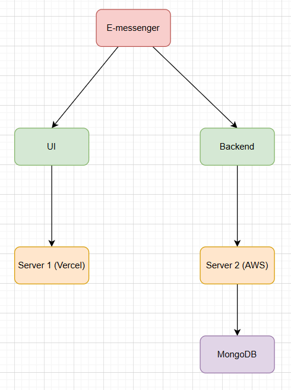
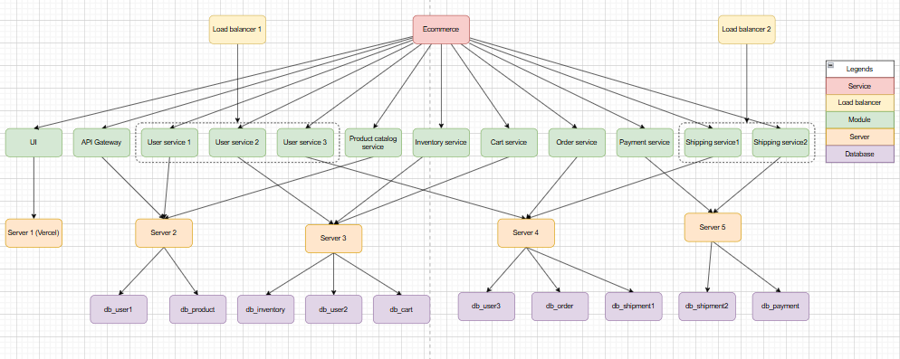

# Load balancer
**Chức năng chính**: Phân phối lưu lượng truy cập 

**Cách hoạt động**:
* Nhận request từ client → phân chia đến các instance của service (theo thuật toán như Round Robin, Least Connections, IP Hash, …).
* Chỉ quan tâm đến việc cân bằng tải, không can thiệp sâu vào logic nghiệp vụ hay routing phức tạp.

Ví dụ: Nginx, HAProxy, AWS ELB, Google Cloud Load Balancing.

# Api gateway
**Mục đích chính**: Là điểm truy cập duy nhất (single entry point) cho toàn bộ microservices.

**Chức năng chính**:
* Định tuyến request đến đúng dịch vụ dựa trên đường dẫn hoặc thông tin khác.
* Tích hợp xác thực/ủy quyền (authentication & authorization).
* Chuyển đổi giao thức (HTTP ↔ gRPC, WebSocket…).
* Gom và tổng hợp dữ liệu từ nhiều service.
* Thực hiện rate limiting, logging, caching, request/response transformation.

Ví dụ:
* Request /users → user-service
* Request /orders → order-service

# Storage
Storage là phần chịu trách nhiệm lưu trữ dữ liệu vật lý trên đĩa, bao gồm cả cơ chế ghi, đọc và quản lý file.

Nó bao gồm:
* **Data files**: tệp chứa dữ liệu thực tế (bản ghi, bảng).
* **Index files**: tệp chứa cấu trúc index để tìm kiếm nhanh.
* **Log files**: tệp lưu các thao tác (transaction log, redo log) để khôi phục khi lỗi.
* **Metadata:** thông tin cấu trúc bảng, schema, quyền truy cập.

Về vật lý, dữ liệu trong DB không "trôi nổi" đâu đó — nó được lưu dưới dạng file hoặc nhiều file trên hệ thống file (ext4, NTFS, xfs,...).
Ví dụ:
* MySQL (InnoDB)
  * Mỗi database = 1 folder.
  * Mỗi table = file .ibd (chứa cả data và index) nếu innodb_file_per_table=ON.
  * Ngoài ra có:
    * ibdata1: shared tablespace (khi không dùng file_per_table).
    * ib_logfile0, ib_logfile1: redo logs.
    * Binary logs: binlog.000001 (ghi lịch sử query).
    * Dữ liệu lưu theo page 16KB → mỗi page chứa nhiều record.

* PostgreSQL
  * Mỗi database = 1 folder trong PGDATA/base/.
  * Mỗi table/index = nhiều file segment (mỗi segment ~1GB).
  * WAL (Write-Ahead Log) nằm trong pg_wal/ để đảm bảo durability.

* MongoDB
    * Lưu trong file .wt (WiredTiger storage engine).
    * Mỗi collection có metadata riêng.
    * Journal files để phục hồi.

Một database hoàn toàn có thể được lưu trên nhiều ổ cứng khác nhau, tùy ở mức phần cứng, hệ điều hành hoặc do DB engine quản lý.

Tùy vào DBMS mà việc này có thể được thực hiện như Sharding, Replication hoặc lưu trữ dữ liệu trên storage layer hỗ trợ phân tán (RAID, SAN,...).

# Sơ đồ logic thủ công mẫu
## Sơ đồ hệ thống E-messenger theo kiến trúc Monolith

## Sơ đồ hệ thống Ecommerce theo kiến trúc microservice
