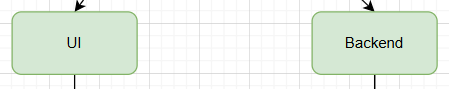
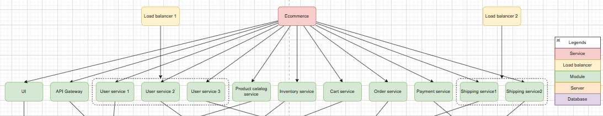

- [Chốt các tầng trong topology](#chốt-các-tầng-trong-topology)
  - [Tầng 1: Service](#tầng-1-service)
  - [Tầng 2: Load balancer (nếu có)](#tầng-2-load-balancer-nếu-có)
  - [Tầng 3: Module](#tầng-3-module)
  - [Tầng 4: Server](#tầng-4-server)
  - [Tầng 5: Database](#tầng-5-database)
- [Logic vẽ topo](#logic-vẽ-topo)
  - [Node](#node)
  - [Label](#label)
  - [Edge structure](#edge-structure)
- [Công nghệ dự kiến sử dụng](#công-nghệ-dự-kiến-sử-dụng)

# Chốt các tầng trong topology
## Tầng 1: Service
Service trong dự án này là dịch vụ cung cấp cho người dùng. Dịch vụ này có thể được cung cấp dưới dạng web, mobile, desktop app,...

Service là thành phần logic đại cho toàn bộ hệ thống phần mềm, không phải là thành phần vật lý được host ở server.

Ví dụ: Viettel telecom, Viettel post, Viettel pay,... Mỗi dịch vụ có thể được triển khai bằng nhiều cách như web/app. Nhưng ở đây chỉ đại diện cho dịch vụ nói chung (không nói về cách triển khai).

## Tầng 2: Load balancer (nếu có)
Load balancer là thành phần có vai trò phân phối yêu cầu (request) đến các instance của cùng một module để tránh quá tải và đảm bảo thời gian phản hồi người dùng.

## Tầng 3: Module
Bao gồm tất cả các thành phần ở tầng application/ business. Đây là những thành phần trực tiếp cấu thành ứng dụng.

  
Ví dụ như một dịch vụ theo kiến trúc monolith chỉ triển khai trên web sẽ có 2 module là UI (tầng application) và Backend (tầng business).

  
Ví dụ một dịch vụ theo kiến trúc microservice.

## Tầng 4: Server
Là máy chủ host các module.

## Tầng 5: Database
Thành phần lưu trữ dữ liệu.

# Logic vẽ topo
## Node
Các node của cùng một tầng biểu diễn bằng icon đại diện cho tầng đó.

## Label
<Tên service>/ <Địa chỉ IP:Port>

## Edge structure
Thể hiện bằng đường thẳng nối giữa 2 thành phần.

# Công nghệ dự kiến sử dụng
Reactflow
